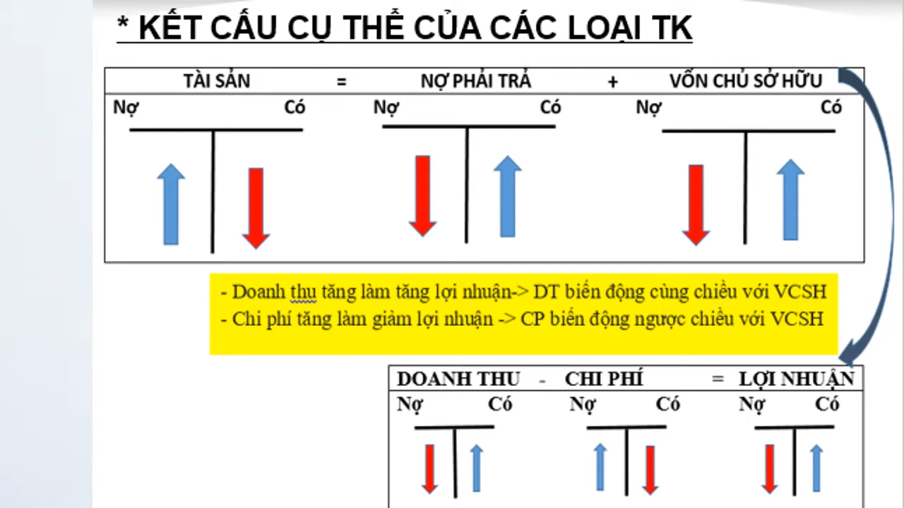
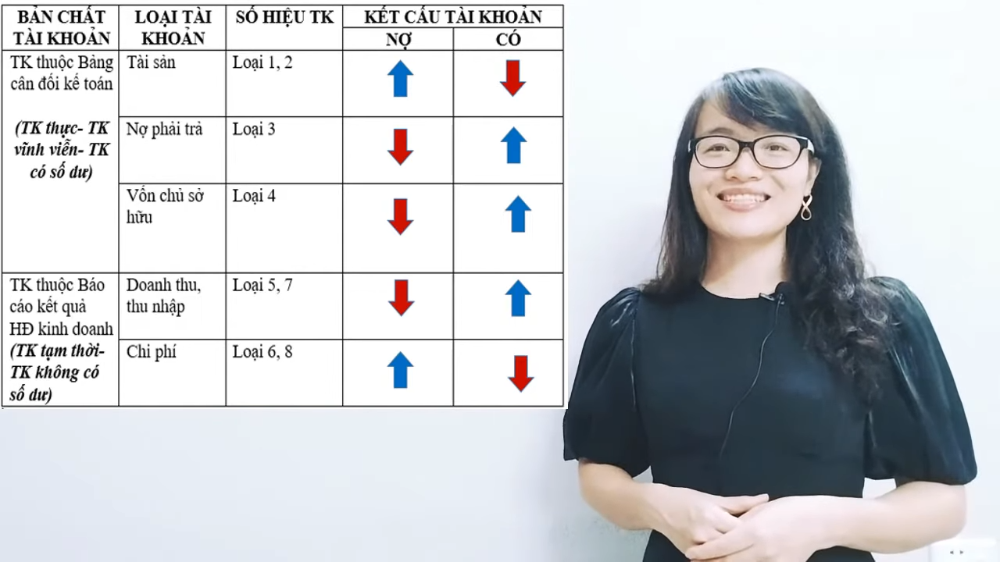
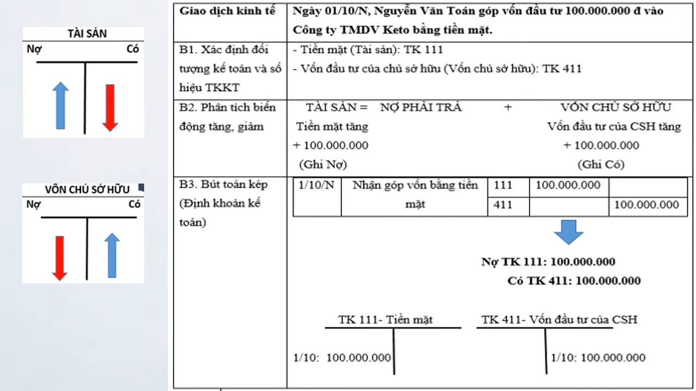
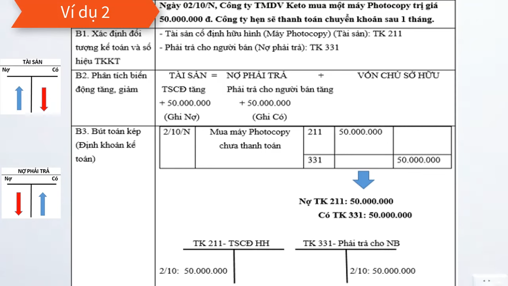
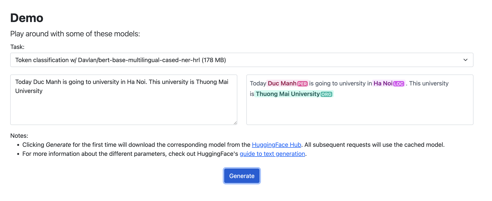
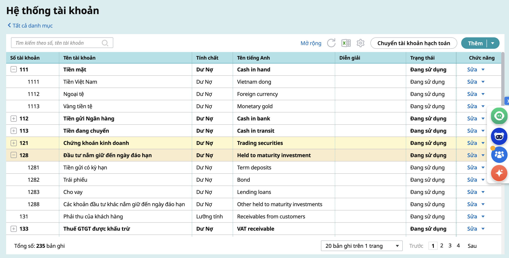

# Project Nghiên cứu cách gợi ý tài khoản nợ có của chứng từ kế toán dựa vào diễn giải mà người dùng nhập liệu trên chứng từ

## Cách cài đặt các package

venv

```
python -m venv venv
source venv/bin/activate
```

install package

```
pip install -r requirements.txt
```

# Xác định nghiệp vụ tài khoản kế toán

## Kết cấu cụ thể của các loại tài khoản kế toán:

Tài sản = Nợ phải trả + Vốn chủ sở hữu

Doanh thu - Chi phí = Lợi nhuận



Trong đó:

- Tài sản: Ghi tăng bên nợ, ghi giảm bên có

- Nợ phải trả: Ghi giảm bên nợ, ghi tăng bên có

- Vốn chủ sở hữu: Ghi giảm bên nợ, ghi tăng bên có

- Doanh thu: Ghi giảm bên nợ, Ghi tăng bên có

- Chi phí: Ghi tăng bên nợ, ghi giảm bên có

- Lợi nhuận: Ghi giảm bên nợ, ghi tăng bên có

## Danh sách các nhóm tài khoản:

- Loại 1, loại 2 là tài sản

- Loại 3, loại 4 là nguồn vốn

- Loại 5, loại 7 là doanh thu, thu nhập

- Loại 6, loại 8 là chi phí

- Loại 9 xác định kết quả hoạt động kinh doanh



## Mỗi khi muốn điền tài khoản nợ, có, kế toán viên phải thực hiện 3 bước sau:

Ví dụ 1: Ngày 01/10/2025, Nguyễn Văn Toán góp vốn đầu tư 100000000 đ vào Công ty TMDV Keto bằng tiền mặt.




Bước 1: Xác định đối tượng kế toán và số hiệu tài khoản kế toán:

- Tiền mặt (Tài sản): TK 111

- Vốn đầu tư chủ sở hữu (Vốn chủ sở hữu): TK 411

Bước 2: Phân tích biến động tăng, giảm:

Tài sản = Nợ phải trả + Vốn chủ sở hữu

- Tiền mặt tăng 100000000 đ (Ghi nợ)

- Vốn đầu tư của chủ sở hữu tăng 100000000 đ (Ghi có)

Bước 3: Bút toán kép (Định khoản kế toán):

- Tài khoản nợ: 111

- Tài khoản có: 411

Ví dụ 2: Ngày 02/10/2025, Công ty TMDV Keto mua một máy Photocopy trị giá 50000000 đ. Công ty hẹn sẽ thanh toán chuyển khoản sau 1 tháng.



Bước 1: Xác định đối tượng kế toán và số hiệu tài khoản kế toán:

- Tài sản cố định hữu hình (Máy photocopy) (Tài sản): TK 221

- Phải trả cho người bán (Nợ phải trả): TK 331

Bước 2: Phân tích biến động tăng, giảm:

Tài sản = Nợ phải trả + Vốn chủ sở hữu

- Tài sản cố định tăng 50000000 đ (Ghi nợ)

- Phải trả cho người bán tăng 50000000 đ (Ghi có)

Bước 3: Bút toán kép (Định khoản kế toán):

- Tài khoản nợ: 221

- Tài khoản có: 331

# Ứng dụng model AI để gợi ý được đủ 3 bước này:

## Tại bước 1: Sử dụng model AI PhoBERT fine-tune cho bài toán NER (model được huấn luyện cho tiếng việt)

Dùng PhoBERT để bóc tách diễn giải ra NER (sẽ giải thích ở bên dưới)

hướng dẫn sử dụng model PhoBERT để thao tác với tiếng việt, tham khảo

[PhoBERT film momo](sample_bert/Phobert_FilmMomo.ipynb)

hướng dẫn NER với PhoBERT, tham khảo

https://github.com/Avi197/Phobert-Named-Entity-Reconigtion

### Named Entity Recognition - NER

NER là "Nhận dạng thực thể". Vai trò chính của tác vụ này là nhận dạng các cụm từ trong văn bản và phân loại chúng vào trong các nhóm đã được định trước

Ví dụ: Tên người, tổ chức, địa điểm, thời gian, loại sản phẩm, nhãn hiệu,...

Câu text mẫu:

Hôm nay Tô Mạnh đi mua 10 gói mì tôm.

Khi dùng NER, nhận biết được "Tô Mạnh" là "Person", "mua" là "Action", "10" là "Quantity", "mì tôm" là "Inventory"

### IOB - Inside, Outside, Beginning

IOB format (còn gọi là BIO) là một cách mã hóa nhãn (tagging) phổ biến trong xử lý ngôn ngữ tự nhiên (NLP), đặc biệt dùng cho tác vụ chunking hoặc named-entity recognition (NER) — tức là phân đoạn (chunk) hoặc xác định các thực thể có tên trong văn bản.
Wikipedia

“I” (Inside) chỉ rằng từ/token nằm bên trong một chunk (không phải từ đầu).
Wikipedia

“B” (Beginning) chỉ rằng từ đó là bắt đầu của một chunk.
Wikipedia

“O” (Outside) dùng cho các từ không thuộc chunk nào (ngoài các chunk)
Wikipedia

Ví dụ: "Nguyễn Văn A làm việc tại Đại học Quốc gia Hà Nội."

Nguyễn → (B-PER B = Bắt đầu, PER = Person); Văn → I-PER; A → I-PER; làm → O; việc → O; tại → O; Đại → (B-ORG B = Bắt đầu, ORG = Organization); học → I-ORG; Quốc → I-ORG; gia → I-ORG; Hà → I-ORG; Nội → I-ORG; . → O;



### Tập nhãn đề xuất cho NER

B/I-ASSET: Tài sản (đầu tài khoản 1, 2) (Tiền mặt, tiền gửi, vật tư, máy móc, phải thu...)

B/I-EXPENSE: Chi phí (đầu tài khoản 6, 8) (Chi phí lương, chi phí quảng cáo, giá vốn hàng bán...)

B/I-LIABILITY: Nợ phải trả (đầu tài khoản 3) (Phải trả người bán, vay ngân hàng, thuế...)

B/I-EQUITY: Vốn chủ sở hữu (đầu tài khoản 4) (Vốn đầu tư của chủ sở hữu, quỹ, lợi nhuận sau thuế chưa phân phối...)

B/I-REVENUE: Doanh thu (đầu tài khoản 5, 7) (Doanh thu bán hàng, thu nhập khác, doanh thu tài chính...)

B/I-PROFIT: Lợi nhuận (đầu tài khoản 9) (Xác định kết quả kinh doanh)

B/I-AMOUNT: Giá trị (50,000,000đ, 100 triệu, 10 gói mì tôm...)

B/I-ACTION: Hành động (Mua, bán, góp vốn, thanh toán, nhận...)

0: Khác (Ngày, hôm nay, tại, của, của công ty...)

## Tại bước 2: Dựa vào danh sách các từ đã bóc tách được

### Sử dụng Rule base (code truyền thống) hoặc GPT để phân tích biến động tăng giảm

Ưu tiên Rule base => Đây là logic nghiệp vụ kế toán gần như bất biến. Nếu dùng rule base thì kết quả trả về gần như tức thì.

Ví dụ: Nếu NER bóc tách được (ASSET - Tài sản) + (ACTION=Mua/Nhận) → ASSET Tăng (Ghi Nợ).

=> Bước này chỉ nhằm xác định xem tài khoản sắp tới định lấy ra sẽ ghi ở ô tài khoản nợ hay tài khoản có

### Tránh dùng GPT để tăng tốc độ.

GPT cho kết quả phản hồi rất lâu (gen từng text một theo thuật toán transformers).

Mà lỗi lần lại gen 1 kiểu.

## Tại bước 3: Ánh xạ mã tài khoản (Định khoản)

Sử dụng cách tra cứu tài khoản trong database hoặc mô hình phân loại siêu tốc

Ưu tiên tra cứu để tốc độ nhanh.

Ví dụ: Nếu bước 2 xác định ASSET - Tài sản là tăng và thực thể (entity) ở đây là Tiền mặt → tìm ra số tài khoản tương ứng

Ở bước nhận diện số tài khoản này có 2 hướng xử lý:

- Xử lý theo nghiệp vụ chung: trả về default tài khoản 111

- Xử lý theo hướng cá nhân hóa: lặp lại từ bước 1 với các diễn giải các chứng từ đã lập của người dùng tại database cụ thể, kiểm tra xem tài khoản đã lưu của người dùng là gì. ví dụ 1111 thì lấy 1111, không có thì lấy 111
(có thể tạo 1 bảng cơ sở dữ liệu, với các cột ví dụ như: tài sản và số tài khoản, nguồn vốn và số tài khoản,... => khi user nhập thêm 1 chứng từ lại bóc tách ra xem nó phù hợp bảng tài sản + số tài khoản hay nguồn vốn + số tài khoản)



### Cân nhắc dùng machine learning hoặc 1 model PhoBert fine-tune khác cho bài toán classification trên structured features

Từ NER đã bóc tách có tập thông tin dạng structured:

Entity types: ASSET, LIABILITY, EXPENSE, …

Entity text (normalized): “tiền mặt”, “máy photocopy”, “phải trả người bán”…

Action: mua, bán, góp vốn…

=> Tạo ra feature vector được. Đầu ra sẽ chỉ có 1 cột duy nhất là tài khoản nợ là gì, tài khoản có là gì

Nếu cần phân loại phức tạp hơn (ví dụ: 621, 622, 627), dùng một Mô hình Phân loại đơn giản (như SVM hoặc Linear Layer trên đầu ra của PhoBERT) đã được huấn luyện riêng.

### Giải pháp dự phòng

2 library như spaCy và underthesea cũng có thể xử lý NLP, cân nhắc xem nếu PhoBERT không hiệu quả thì dùng 2 thư viện kia.

Trong đó underthesea tập trung cho tiếng Việt hơn
